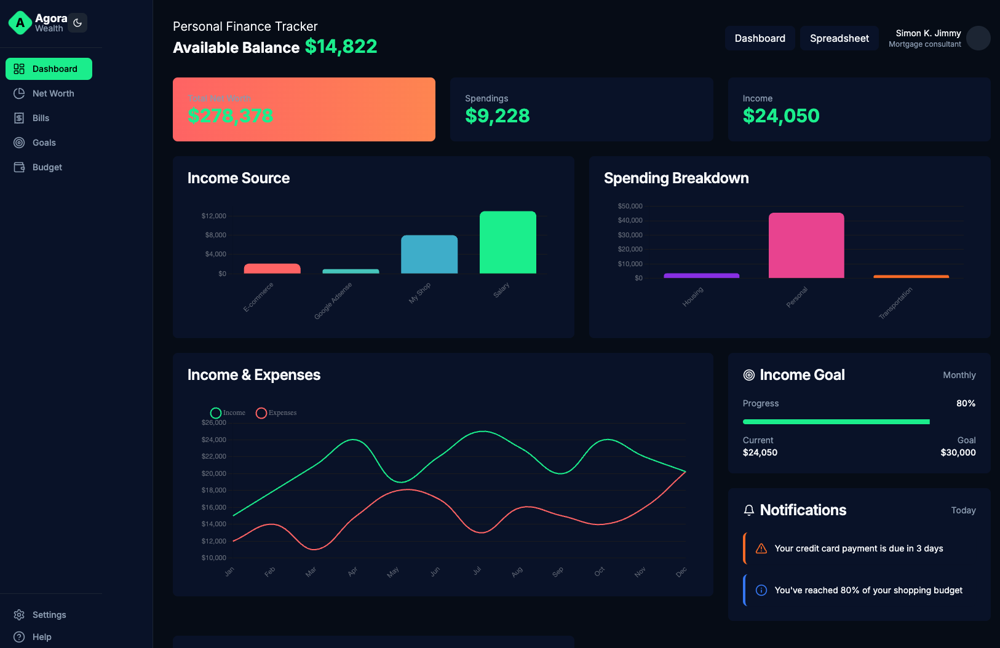

# Personal Finance Wealth Dashboard (POC)

A modern wealth management and financial tracking dashboard built with Next.js and TypeScript. It provides comprehensive financial visualization and management tools including net worth tracking, budget management, bill tracking, and financial goal setting.



## Features

- 📊 **Comprehensive Dashboard** - View your entire financial picture at a glance
- 💰 **Net Worth Tracking** - Track your assets, liabilities, and net worth over time
- 📈 **Budget Management** - Set and track budgets with detailed category breakdowns
- 💳 **Bill Tracking** - Never miss a payment with bill due date tracking
- 🔄 **Recurring Transactions** - Monitor your subscriptions and recurring payments
- 🎯 **Financial Goals** - Set and track progress towards your financial goals
- 📱 **Responsive Design** - Fully functional on both desktop and mobile devices
- 🌓 **Dark/Light Mode** - Choose your preferred theme

## Tech Stack

- **Framework**: [Next.js 14](https://nextjs.org/)
- **Language**: [TypeScript](https://www.typescriptlang.org/)
- **Styling**: [Tailwind CSS](https://tailwindcss.com/)
- **UI Components**: [shadcn/ui](https://ui.shadcn.com/)
- **Charts**: 
  - [Chart.js](https://www.chartjs.org/)
  - [react-chartjs-2](https://react-chartjs-2.js.org/)
  - [Google Charts](https://developers.google.com/chart) (Sankey Diagrams)
- **Icons**: [Lucide Icons](https://lucide.dev/)
- **Theme Switching**: [next-themes](https://github.com/pacocoursey/next-themes)

## Getting Started

### Prerequisites

- Node.js 18+ 
- npm or yarn

### Installation

1. Clone the repository:

```bash
git clone
